<p align="center">
  <a href="https://github.com/ishandutta2007/Awesome-Awesome-Awesome"></a>
  <a href="https://discord.gg/jc4xtF58Ve"></a>
  <a href="https://github.com/ishandutta2007/Awesome-CDP/stargazers"></a>
  <a href="https://github.com/ishandutta2007/Awesome-CDP/blob/main/LICENSE"></a>
  <a href="https://github.com/ishandutta2007/Awesome-CDP/commits/main"></a>
  <a href="https://github.com/ishandutta2007"></a>
</p>



# ⚡ Awesome Customer Data Platform (CDP) Ecosystem

> 🚀 **A curated directory of enterprise SaaS platforms and self-hosted Open-Source projects for Customer Data Unification, Identity Resolution, Audience Segmentation, and Data Activation.**

---

## 📌 Table of Contents
- [🌐 Overview & Key Concepts](#-overview--key-concepts)
- [🏢 SaaS & Hosted CDP Platforms](#-saas--hosted-cdp-platforms)
- [🔓 Open-Source GitHub Projects](#-open-source-github-projects)
- [🛠 Architectural Patterns & Stacks](#-architectural-patterns--stacks)
- [🤝 How to Contribute](#-how-to-contribute)
- [📈 Star History](#-star-history)
- [💖 Support & Community](#-support--community)
- [⚠️ Disclaimer](#%EF%B8%8F-disclaimer)

---

## 🌐 Overview & Key Concepts

A **Customer Data Platform (CDP)** centralizes customer data collected across web, mobile, offline, and server-side channels into a single persistent database. Modern CDPs construct unified **Customer 360** profiles, perform **Identity Resolution**, build real-time **Audience Segments**, and enable **Data Activation** across downstream marketing, analytics, and operational systems.

### 💡 Core Pillars of CDP Technology
- 🔄 **Data Collection & Ingestion**: Real-time event SDKs, server-side APIs, and cloud connectors (ETL/ELT).
- 🆔 **Identity Resolution**: Deterministic and probabilistic cross-device user profile stitching.
- 🎯 **Segmentation & Orchestration**: Dynamic audience filtering, predictive scoring, and multi-channel customer journeys.
- ⚡ **Warehouse-Native & Composable Architecture**: Executing syncs directly on data warehouses (Snowflake, BigQuery, Databricks, Redshift) via Reverse ETL.

---

## 🏢 SaaS & Hosted CDP Platforms

> 📊 **CDP Market Insights**: The global Customer Data Platform market is valued at **$7.4 Billion in 2026** (projected to reach $28+ Billion by 2032 at a 25% CAGR). The market structure is **moderately fragmented**, characterized by healthy competition between packaged legacy CDPs, emerging warehouse-native composable tools, and open-source ingestion platforms.

Below is a curated summary of enterprise SaaS CDPs, sorted by **Company Size / Valuation / Revenue** in descending order.

| 🏢 Platform | 🔍 Key Capabilities & Focus | 💰 Starting Price | 🎁 Free Tier / Trial Limits | 📊 Company Size / Valuation / Revenue |
| :--- | :--- | :--- | :--- | :--- |
| **[Twilio Segment](https://segment.com/)** | Developer-first event collection, 450+ turnkey integrations, Schema Governance (Protocols), and Identity Resolution (Unify). | **$120 / month** (Team Plan) | **Free Forever** (up to 1,000 MTUs/mo, 2 sources, 1 warehouse destination) | **$3.2 Billion** (Acquired by Twilio) / ~$300M ARR |
| **[Tealium](https://tealium.com/)** | Deep tag management roots, enterprise security & HIPAA-compliant private cloud, 1,200+ integration connectors. | **$1,500 / month** ($18,000/yr) | **30-Day Free Trial** (Developer Sandbox with 50K event ceiling) | **$1.2 Billion** (Series G Valuation) / ~$120M ARR |
| **[Treasure Data](https://www.treasuredata.com/)** | Hybrid packaged & composable CDP, sub-second profile lookups, enterprise analytics engine. | **$3,500 / month** ($42,000/yr) | **14-Day Free Trial** (Custom demo environment, max 500K records) | **$1.0+ Billion** (SoftBank/Arm spinout, $234M Series C) |
| **[Hightouch](https://hightouch.com/)** | Category leader in Composable & Warehouse-Native CDP. Zero-copy querying directly from Snowflake/BigQuery. | **$350 / month** (Starter Plan) | **Free Forever** (1 sync destination, unlimited triggers & sync runs) | **$615 Million** (Series B Valuation) |
| **[mParticle](https://www.mparticle.com/)** | Mobile-first CDP with low TCO, real-time data cleansing, and GenAI roadmap integrations. | **$2,500 / month** (Growth Plan) | **30-Day Free Trial** (Limited to 1M events/month) | **$300 Million** (Acquired by Rokt in Jan 2025) |
| **[ActionIQ](https://www.actioniq.com/)** | Hybrid warehouse-native enterprise CDP with zero-copy architecture and business self-service segmentation. | **$5,000 / month** ($60,000/yr) | **14-Day Proof-of-Concept Trial** (Guided sandbox environment) | **$300 Million** (Valuation / Acquired by Uniphore) |
| **[RudderStack Cloud](https://rudderstack.com/)** | Commercial managed cloud for RudderStack open-source core. Reverse ETL, event streaming, and privacy governance. | **$500 / month** (Starter Cloud) | **Free Forever** (up to 1 Million events/mo & 3 source connections) | **$300 Million** (Series B Valuation / $82M Raised) |
| **[Blueshift](https://blueshift.com/)** | SmartHub CDP combining customer data unification with predictive AI and omnichannel campaign orchestration. | **$1,000 / month** (Growth Plan) | **14-Day Free Trial** (Limited to 50K active customer profiles) | **$200 Million** (Series C Valuation / $65M Raised) |
| **[Zeotap](https://zeotap.com/)** | Open CDP architecture operating on customer-owned lakehouses (Apache Spark & Iceberg tables) for strict data sovereignty. | **$2,200 / month** (€2,000/mo) | **30-Day Free Trial** (GCP / AWS Marketplace Sandbox) | **$160 Million** (Valuation / $90M Total Raised) |
| **[Lytics](https://lytics.com/)** | Composable CDP with machine learning behavioral scoring integrated into digital content management platforms. | **$1,200 / month** (Cloud Growth) | **30-Day Free Trial** (Limited to 100K active customer profiles) | **$58 Million** (Total Raised / Acquired by Contentstack) |

---

## 🔓 Open-Source GitHub Projects

Open-source CDP solutions provide maximum transparency, full data sovereignty, and custom extensibility. Below is a comprehensive list of active open-source projects, sorted by **GitHub Star Count** in descending order.

1. **[PostHog](https://github.com/PostHog/posthog)** [](https://github.com/PostHog/posthog/stargazers)
   - **Description**: All-in-one open-source product analytics, session recording, feature flags, A/B testing, and event ingestion CDP platform. Python/TypeScript stack.
   - **License**: MIT / Open Source.

2. **[Airbyte](https://github.com/airbytehq/airbyte)** [](https://github.com/airbytehq/airbyte/stargazers)
   - **Description**: Leading open-source ELT data pipeline platform with 600+ connectors to extract and load data into data warehouses for CDP storage.
   - **License**: ELv2 / MIT.

3. **[Snowplow](https://github.com/snowplow/snowplow)** [](https://github.com/snowplow/snowplow/stargazers)
   - **Description**: Enterprise-grade open-source behavioral data collection and event streaming framework designed for real-time customer data pipelines.
   - **License**: Apache 2.0 / Open Source.

4. **[Jitsu](https://github.com/jitsucom/jitsu)** [](https://github.com/jitsucom/jitsu/stargazers)
   - **Description**: Open-source high-performance data ingestion engine and real-time reverse ETL tool built as a lightweight alternative to Segment.
   - **License**: MIT / Open Source.

5. **[RudderStack Core](https://github.com/rudderlabs/rudder-server)** [](https://github.com/rudderlabs/rudder-server/stargazers)
   - **Description**: Production-grade open-source CDP core written in Go. Collects and routes event data directly to your data warehouse without data retention.
   - **License**: SSPL / Open Source.

6. **[Meltano](https://github.com/meltano/meltano)** [](https://github.com/meltano/meltano/stargazers)
   - **Description**: CLI-first open-source DataOps infrastructure powering ELT pipelines and data integration for warehouse-native CDP setups.
   - **License**: MIT / Open Source.

7. **[Tracardi](https://github.com/tracardi/tracardi)** [](https://github.com/tracardi/tracardi/stargazers)
   - **Description**: Composable, API-first open-source CDP written in Python with Elasticsearch backend. Provides user profile management and low-code rule flows.
   - **License**: MIT / Open Source.

8. **[Apache Unomi](https://github.com/apache/unomi)** [](https://github.com/apache/unomi/stargazers)
   - **Description**: Java-based open-source Customer Data Platform server developed under the Apache Software Foundation, implementing OASIS CXS standards.
   - **License**: Apache 2.0.

9. **[Pimcore Customer Data Framework](https://github.com/pimcore/customer-data-framework)** [](https://github.com/pimcore/customer-data-framework/stargazers)
   - **Description**: Open-source PHP CDP extension integrating customer profile management and segment building within Pimcore PIM/MDM suite.
   - **License**: GPLv3 / Open Source.

10. **[LEO CDP](https://github.com/trieu/leo-cdp-framework)** [](https://github.com/trieu/leo-cdp-framework/stargazers)
    - **Description**: Open-source AI-first CDP framework featuring Customer 360, RFM segmentation, ML churn prediction, and automated personalization.
    - **License**: AGPL v3 / Open Source.

---

## 🛠 Architectural Patterns & Stacks

```
  ┌──────────────────┐    ┌──────────────────┐    ┌──────────────────┐
  │  Event Sources   │    │  In-App Mobile   │    │   SaaS CRMs      │
  │ (Web/JS Tracker) │    │   (iOS/Android)  │    │  (HubSpot/SFDC)  │
  └────────┬─────────┘    └────────┬─────────┘    └────────┬─────────┘
           │                       │                       │
           └───────────────────────┼───────────────────────┘
                                   ▼
                   ┌──────────────────────────────┐
                   │  Ingestion & Event Streaming │
                   │   (RudderStack / Airbyte)    │
                   └───────────────┬──────────────┘
                                   │
                                   ▼
                   ┌──────────────────────────────┐
                   │   Central Data Warehouse     │
                   │ (Snowflake / BigQuery / dbt) │
                   └───────────────┬──────────────┘
                                   │
                                   ▼
                   ┌──────────────────────────────┐
                   │  Identity & Data Activation  │
                   │ (Hightouch / Tracardi / LEO) │
                   └───────────────┬──────────────┘
                                   │
                                   ▼
  ┌──────────────────┐    ┌──────────────────┐    ┌──────────────────┐
  │ Ad Destinations  │    │ Email Campaigns  │    │ Push Analytics   │
  │  (Meta / Google) │    │    (Braze/Klaviyo)│    │ (Mixpanel/Amplitude)
  └──────────────────┘    └──────────────────┘    └──────────────────┘
```

### 💡 Building a Modular Open-Source / Composable Stack
1. **Event Capture & Streaming**: Use **RudderStack** or **Jitsu** for client/server tracking.
2. **Batch & SaaS Extraction**: Use **Airbyte** or **Meltano** for ELT data extraction.
3. **Storage & Transformation**: Store in **Snowflake**, **BigQuery**, or **Databricks** and transform with **dbt**.
4. **Activation & Reverse ETL**: Use **Hightouch** or **Tracardi** to sync structured segments back into operational marketing tools.

---

## 🤝 How to Contribute

Contributions are warmly welcomed! Please follow these simple steps:

1. 🍴 **Fork** this repository.
2. 📝 Add or edit entries in `README.md` following the standard table/list layout.
3. 🔗 Ensure all links, descriptions, starting prices, and license information are accurate.
4. 🚀 Submit a **Pull Request** with a brief summary of additions.

See the curated master repository index at [Awesome-Awesome-Awesome](https://github.com/ishandutta2007/Awesome-Awesome-Awesome).

---

## 📈 Star History

[](https://star-history.dera.page/#ishandutta2007/Awesome-CDP&type=date&legend=top-left)

---

## 💖 Support & Community

Thank you for visiting **Awesome-CDP**! If this list has saved you time or aided your customer data architecture decisions:

- ⭐ **Star** this repository to show your appreciation!
- 🔀 **Fork** and contribute missing tools or updates.
- 📢 **Share** with colleagues and software communities.

[](https://github.com/sponsors/ishandutta2007)

---

## ⚠️ Disclaimer

- This list is community-curated for informational and educational purposes.
- Customer Data Platforms process sensitive customer PII. Always ensure strict compliance with GDPR, CCPA, HIPAA, and ISO/SOC regulations before deployment.
